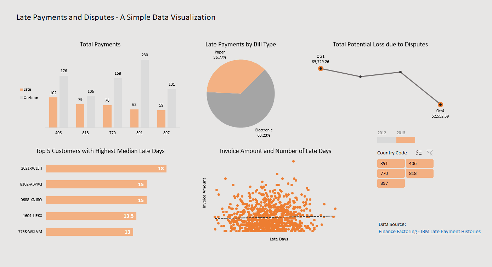

# Late Payment and Disputes - Sample Dataset from IBM Community
## About
This dashboard provides information of account receivable payments from 2012 to 2013. The Excel file consists of raw data with highlighted derived columns, the dashboard, and multiple pivot tables.

Data source: [Finance Factoring - IBM Late Payment Histories](https://www.kaggle.com/hhenry/finance-factoring-ibm-late-payment-histories)
## Preview

